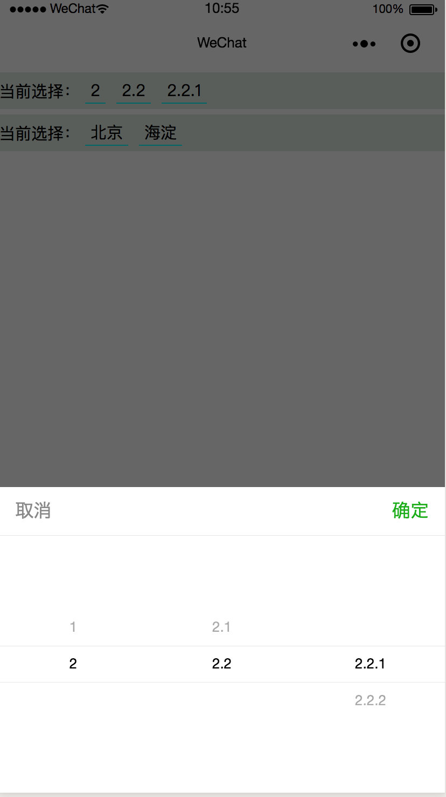
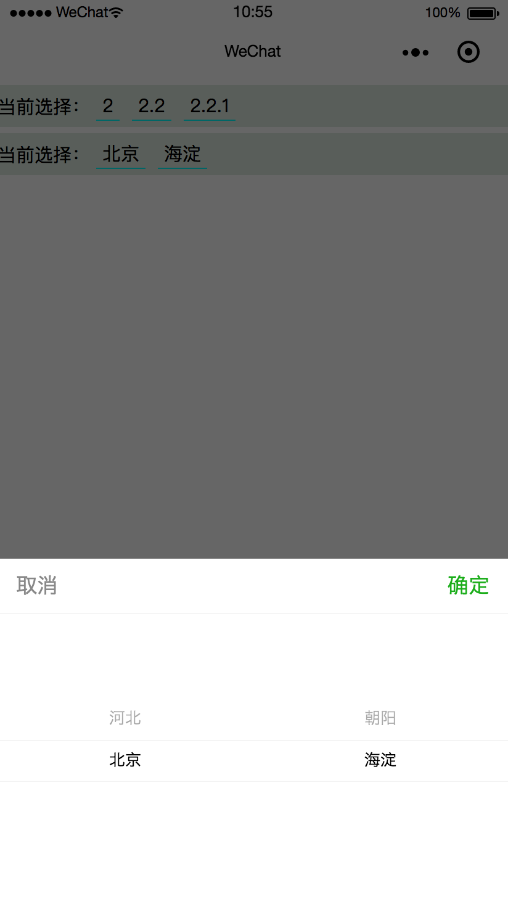
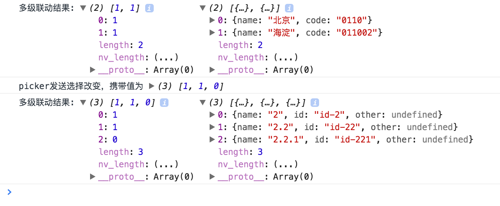

# miniprogram-picker

## 简介

- 微信小程序的Picker组件只是半成品组件，在启用多级联动时需要监听`bindcolumnchange`事件，来手动更改`range`和`value`的值，从而完成Picker的联动变化，比较麻烦，不利于在不同的业务逻辑中的复用。
- 本组件为了解决以上痛点，对微信小程序原生Picker组件进行了二次封装。开发者只需要提供固定数据结构的`sourceData`，再进行一些必要配置，本组件就可以自动帮助开发者处理联动逻辑。
- 本组件支持npm构建，从小程序基础库版本`2.2.1`或以上、及`开发者工具1.02.1808300`或以上开始，小程序支持使用 npm 安装第三方包。

## 效果

<div style="display: flex; flex-direction: row; align-items: center; justify-content: space-around;">
  <a href="./source"></a>
  <a href="./source"></a>
</div>
<div style="display: flex; flex-direction: row; align-items: center; justify-content: center; margin-top: 30px;">
  <a href="./source"></a>
</div>

## API

### 属性

|          属性           |                             说明                             |  类型   |  默认值  | 是否必填 |
| :---------------------: | :----------------------------------------------------------: | :-----: | :------: | :------: |
|       sourceData        | 源数组，sourceData有几维，Picker就可以有几阶。格式必须为数组和对象的集合，参考示例 |  Array  |    []    |   true   |
|          steps          |                         Picker的阶数                         | Number  |    1     |   false   |
|     shownFieldName      |                      展示数据的字段名称                      | String  |  'name'  |  false   |
|     subsetFieldName     |           子节点的字段名称，该字段的值为Picker下一阶的数组           | String  | 'subset' |  false   |
|   otherNeedFieldsName   |         其他需要返回的字段，开发者可以根据需求自定义         |  Array  |    []    |  false   |
|      defaultIndex       |           默认选中项的下标数组，优先于defaultValue           |  Array  |    []    |  false   |
|      defaultValue       | 默认选中项的值数组，此属性启用时defaultValueUniqueField为必填项 |  Array  |    []    |  false   |
| defaultValueUniqueField |      默认选中项的值数组的唯一字段，用来和源数组进行比对      | String  |    ''    |    -     |
|       autoSelect        |   初始化时，是否需要自动调用bindchange事件返回结果给开发者   | Boolean |  false   |  false   |
| initColumnSelectedIndex |     选择了第n列后，是否将大于n的列的选择值自动初始化为0      | Boolean |  false   |  false   |
|        disabled         |                         是否禁用                    | Boolean |  false   |  false   |

### 方法

|       方法       |             说明             |    类型     |                         事件对象                          |
| :--------------: | :--------------------------: | :---------: | :-------------------------------------------------------: |
|    bindchange    |      用户点击确认时触发      | EventHandle |       event.detail = {selectedIndex, selectedArray}       |
|    bindcancel    |      用户点击取消时触发      | EventHandle |    event.detail为原生组件的bindcancel触发时的event对象    |
| bindcolumnchange | 用户滑动某一列的值改变时触发 | EventHandle | event.detail为原生组件的bindcolumnchange触发时的event对象 |


### 规则

  - `sourceData`为源数组，是一个数组对象结构的集合，`sourceData`有几维，Picker就可以有几阶。
  - `steps`，你需要明确指定Picker的阶数，比如三级联动则设置`steps: 3`。
  - 需要注意的是，比如`steps`设置了`3`，那么`sourceData`务必要满足这个阶数。
  - `initColumnSelectedIndex`属性启用后，开发者调试工具上会有失效情况，但是真机目前没有发现问题，所以是否开启请开发者自行决定。
  - `bindchange`触发的事件对象：
    - `selectedIndex`：Picker选择项的索引数组；
    - `selectedArray`：Picker选择项的值数组；
  - 本组件的有些方法和属性与微信原生API的行为一致，比如：`bindchange`，`bindcancel`，`bindcolumnchange`，`disabled`。具体可以查看源码。

## 使用方法

1. 安装`miniprogram-picker`包。
   > 提醒：若是你不想用npm，也可以直接下载最新[release](https://github.com/IceApriler/miniprogram-picker/releases)包放到项目的`components`中，就像用自己写的组件那样，只不过npm更加方便。

   ```bash
   npm install miniprogram-picker --production
   // 或者
   npm install miniprogram-picker --save
   ```

2. 点击微信开发者工具中的菜单栏：工具 --> 构建 npm。此时你会发现项目中多出一个`miniprogram_npm`目录，里面有编译过的`miniprogram-picker`。

3. `.json`中引入`miniprogram-picker`第三方组件。使用方法与使用自己封装的组件相同，只不过不需要写具体路径了，很方便。

   ```json
   {
       "usingComponents": {
       	"miniprogram-picker": "miniprogram-picker"
       }
   }
   ```

4. `.wxml`中使用`miniprogram-picker`。我这里给出了两个小例子，第一个是三级联动，第二个是两级联动。具体属性和事件方法可以参考API。

   > `miniprogram-picker`是没有任何样式的，具体样式开发者可以自定义，如果你熟悉`slot`的用法那就更好了，具体参考[小程序组件wxml的slot](https://developers.weixin.qq.com/miniprogram/dev/framework/custom-component/wxml-wxss.html)。

   ```xml
     <miniprogram-picker
       sourceData="{{sourceData_1}}"
       steps="{{3}}"
       shownFieldName="{{'name'}}"
       subsetFieldName="{{'sonValue'}}"
       otherNeedFieldsName="{{['id', 'other']}}"
       defaultValue="{{[{name: '2'}, {name: '2.2'}, {name: '2.2.1'}]}}"
       defaultValueUniqueField="{{'name'}}"
       autoSelect="{{true}}"
       initColumnSelectedIndex
       disabled="{{false}}"
       bindchange="pickerChange"
       bindcancel="pickerCancel"
       bindcolumnchange="pickerColumnchange"
       data-picker="picker_1">
         <view class="picker">
           当前选择：<view wx:for="{{result_1}}" wx:key="index">{{item['name']}}</view>
         </view>
     </miniprogram-picker>
   
     <miniprogram-picker
       sourceData="{{sourceData_2}}"
       steps="{{2}}"
       shownFieldName="{{'name'}}"
       subsetFieldName="{{'nextLevel'}}"
       otherNeedFieldsName="{{['code']}}"
       defaultValue="{{[{code: '0110'}, {code: '011002'}]}}"
       defaultValueUniqueField="{{'code'}}"
       autoSelect="{{true}}"
       initColumnSelectedIndex
       disabled="{{false}}"
       bindchange="pickerChange"
       bindcancel="pickerCancel"
       bindcolumnchange="pickerColumnchange"
       data-picker="picker_2">
         <view class="picker">
           当前选择：<view wx:for="{{result_2}}" wx:key="index">{{item['name']}}</view>
         </view>
     </miniprogram-picker>
   ```

5. `.js`中设置`sourceData`和监听`pickerChange`事件等。

   ```js
     Page({
       /**
        * 页面的初始数据
        */
       data: {
         result_1: [],
         result_2: [],
         sourceData_1: [
           {
             id: 'id-1',
             name: '1',
             sonValue: [
               {
                 id: 'id-11',
                 name: '1.1',
                 sonValue: [
                   { id: 'id-111', name: '1.1.1' },
                   { id: 'id-112', name: '1.1.2' }
                 ]
               },
               {
                 id: 'id-12',
                 name: '1.2',
                 sonValue: [
                   { id: 'id-121', name: '1.2.1' },
                   { id: 'id-122', name: '1.2.2' }
                 ]
               }
             ]
           },
           {
             id: 'id-2',
             name: '2',
             sonValue: [
               {
                 id: 'id-21',
                 name: '2.1',
                 sonValue: [
                   { id: 'id-211', name: '2.1.1' },
                   { id: 'id-212', name: '2.1.2' }
                 ]
               },
               {
                 id: 'id-22',
                 name: '2.2',
                 sonValue: [
                   { id: 'id-221', name: '2.2.1' },
                   { id: 'id-222', name: '2.2.2' }
                 ]
               }
             ]
           }
         ],
         sourceData_2: [
           { name: '河北', code: '0311', nextLevel: [{ name: '石家庄', code: '031101' }, { name: '保定', code: '031102' }]},
           { name: '北京', code: '0110', nextLevel: [{ name: '朝阳', code: '011001' }, { name: '海淀', code: '011002' }]},
         ]
       },
       /**
        * Picker用户点击确认时触发
        *
        * @param {Object} e pickerChange的事件对象
        * @param {Object} e.detail.selectedIndex 用户选择的数据在数组中所在的下标
        * @param {Object} e.detail.selectedArray 用户选择的数据
        */
       pickerChange(e) {
         const { picker } = e.currentTarget.dataset
         const { selectedIndex, selectedArray } = e.detail
         const list = {
           picker_1: 'result_1',
           picker_2: 'result_2',
         }
         console.log('多级联动结果:', selectedIndex, selectedArray)
         const change = {}
         change[list[picker]] = selectedArray
         this.setData(change)
       },
       /**
        * Picker用户点击取消时触发
        *
        * @param {Object} e  pickerCancel的事件对象
        * @param {Object} e.detail  是原生Picker组件的bindcancel触发时的事件对象e
        */
       pickerCancel(e) {
         console.log(e)
       },
       /**
        * Picker用户滑动某一列的值改变时触发
        *
        * @param {Object} e pickerColumnchange的事件对象
        * @param {Object} e.detail  是原生Picker组件的bindcolumnchange触发时的事件对象e
        */
       pickerColumnchange(e) {
         console.log(e)
       },
     })
   ```

6. `.wxss`中简单设置样式。

   ```css
   .picker {
     display: flex;
     flex-direction: row;
     align-items: center;
     margin: 10rpx 0;
     padding: 10rpx 0;
     background-color: #DEECE2;
     font-size: 28rpx;
   }
   .picker view {
     padding: 2rpx 10rpx;
     margin-left: 10rpx;
     margin-right: 10rpx;
     border-bottom: 2rpx solid aqua;
   }
   ```


## 帮助

- 欢迎提Issue，若是代码有bug或者你不明白的地方，我会尽快解决的。
- 若有feature需要实现，可以Issue留言，若是喜欢，欢迎star。感谢你的支持。